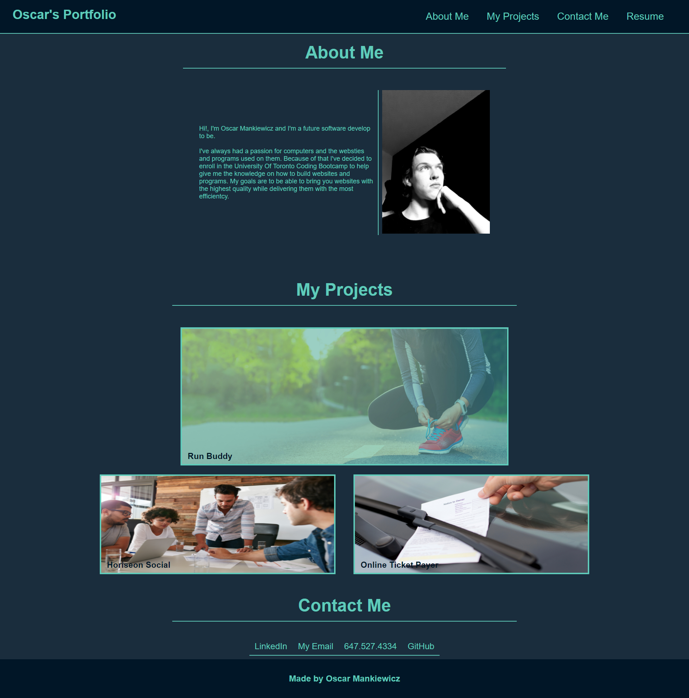

# My-Portfolio

Made By Oscar Mankiewicz

Purpose: A website to show all my past projects and contact info to allow employers
to get an idea of my work.

Note: Could not get mediaqueries to work
Note 2: Was unsure if i was to follow the mock up as is so I took my own approach

link to <a href="https://oatmealcrisp.github.io/My-Portfolio/" target="_blank">My Portfolio</a>

Screenshot 